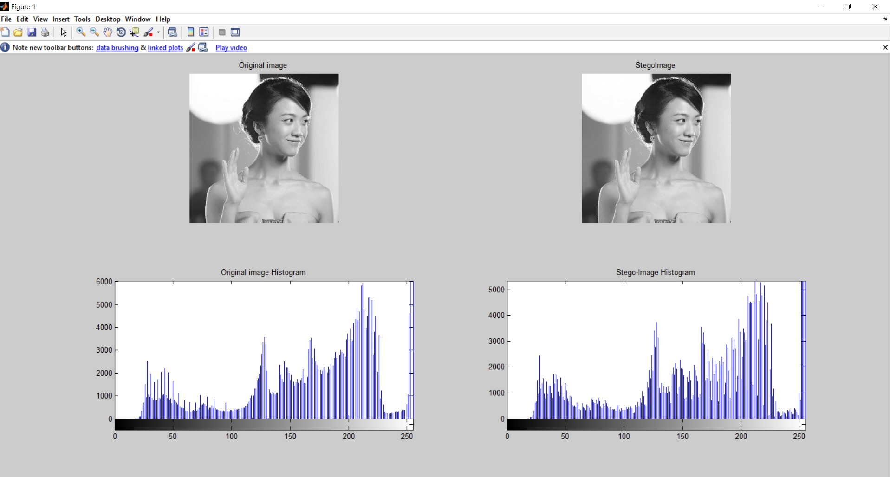

> Image-Steganography Using LSB Algorithm | Graduation Project | Ahmed Abd Elghany | Computer Science | 2019

# Image Steganography using LSB Algorithm

Matlab program for Image Steganography using Least Significant Bit (LSB) Algorithm with the following features:
- Hiding text data in a selcted image.
- Extract text data from a selcted image.
- Analyze and compare between the original and stego-image (PSNR and Histogram)

## Files
<pre>
<b>LSB.m :</b> GUI for the program.
<b>LSB_HIDE.m :</b> Hide function.
<b>LSB_EXTRACT.m :</b> Extracting function.
<b>Calc_PSNR.m :</b> PSNR calculator function.
</pre>

## How to Run Program
<pre>
1. Download project.
2. Open MATLAB program.
3. Open the directory of the project.
4. Open <b>LSB.m</b> file and click Run button.

You will see this GUI:

</pre>

## How to Hide
<pre>
1. Run program.
2. Click on Hide tab.
3. Click on "Select Cover Image" button and select your original image.
4. Click on "Select a Text" button and select your text.
   (I have added examples of different 500, 4000 and 32000 character sizes for test).
5. Click on "Encrypt" button that will ask you for path to save.
5. You will see a PSNR will automatically.
6. Click on "Statistics" button for Histogram between the original and stege-image.

After Hiding <b>msg-4000ch.txt</b> you will see this:

</pre>

## How to Extract
<pre>
1. Run program.
2. Click on Exract tab.
3. Click on "Select Stego-Image" button and select your stego-image.
4. Click on "Extract" button that will ask you for path to save.
5. You will see an Alert tell you "Extracted done".
6. Open the path then you will see your extracted fiel.

After Extracting <b>stego-img500.bmp</b> you will see this:

Your extracted file <b>Recover-msg.txt</b>:

</pre>

## Histogram
<pre>

<b>Histogram between original image and stego-image after hidding 32000 character:</b>
</pre>

## Notes
- The higher PSNR indicates that the quality of the stego-image is similar to the cover image.
- The larger image size, the more data you can hide.
- For a 24-bit color image as the cover image, you can store approximately 3/8th of the cover image size.
- For a grayscale image as the cover image, you can store approximately 1/8th of the cover image size.
